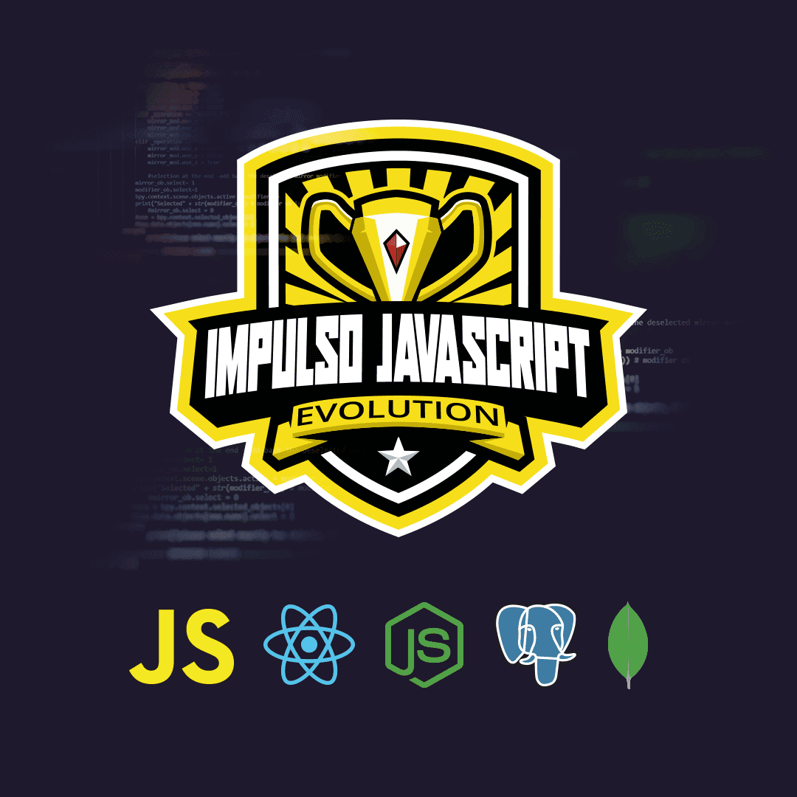

# Desafios do Bootcamp Impulso JavaScript Evolution (Dio)

> Repositório de desafios do bootcamp Impulso Javascript da Dio. A ideia é manter uma pasta raiz com subpastas para cada desafio, de modo a centralizar o conteúdo.

### Ajustes e melhorias

O projeto ainda está em desenvolvimento consiste na implementação de exercícios dos seguintes módulos:

- [ ] Fundamentos Web com HTML e CSS
- [ ] Dominando a Linguagem de Programação Javascript
- [ ] Front-end: Desenvolvimento Web com React
- [ ] Bancos de Dados Relacionais (SQL) e Não Relacionais (NoSQL)
- [ ] Back-end: Criando API com Node.js

## 🚀 Orientações de Instalação

As orientações de instalação estão contidas em cada pasta individual.

[⬆ Voltar ao topo](#nome-do-projeto) 
